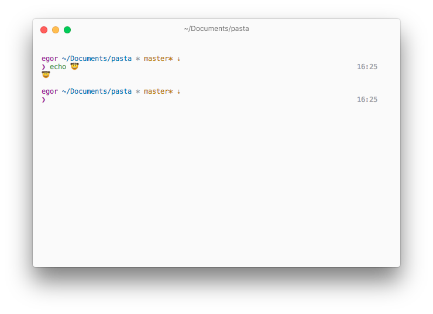

# Pasta

> Another yet ZSH prompt



## Overview

Light, pretty fast and not so ugly prompt

### Shows

* Git status
* Node.js version
* Red promt character on non exit `0` codes
* Execution time(if it's more then `5`)

## Installation

### As an [Oh My ZSH!](https://github.com/robbyrussell/oh-my-zsh) custom theme

Clone pasta into your custom plugins repo

```shell
git clone https://github.com/egorkaru/pasta $ZSH_CUSTOM/themes/pasta
```
Then set a theme in your `.zshrc`

```shell
ZSH_THEME='pasta'
```

## License
`pasta` available under the terms of the MIT License.